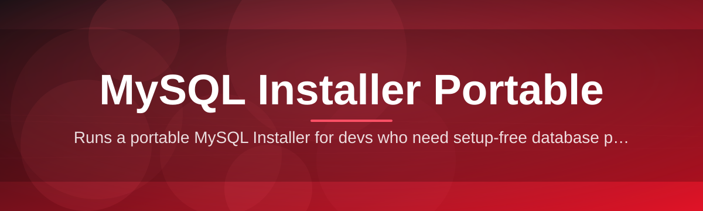

# mysql-installer-companion

Runs a portable MySQL Installer for devs who need setup-free database provisioning on the go

  

## Overview

Runs a portable MySQL Installer for devs who need setup-free database provisioning on the go

## License

[MIT License](LICENSE)
